# java知识点

## JVM

Java 源文件—->编译器—->字节码文件—->JVM—->机器码

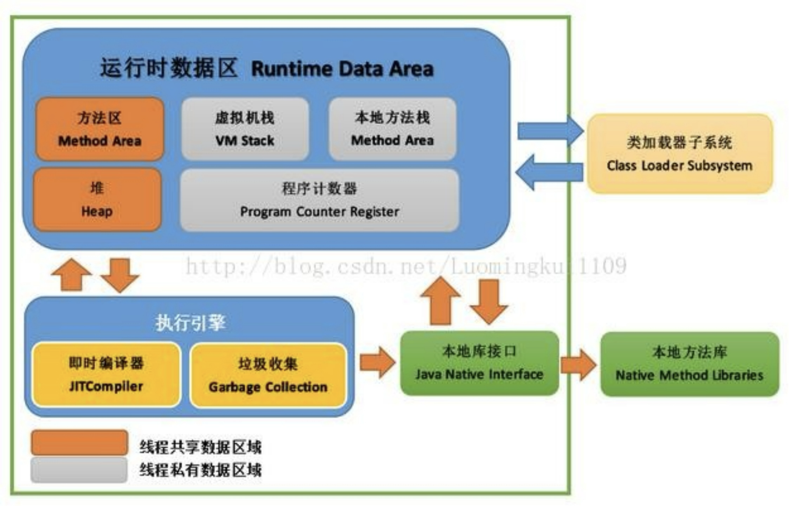

### 线程

这里所说的线程指程序执行过程中的一个线程实体。JVM 允许一个应用并发执行多个线程。Hotspot JVM 中的 Java 线程与原生操作系统线程有直接的映射关系。当线程本地存储、缓冲区分配、同步对象、栈、程序计数器等准备好以后，就会创建一个操作系统原生线程。Java 线程结束，原生线程随之被回收。操作系统负责调度所有线程，并把它们分配到任何可用的 CPU 上。当原生线程初始化完毕，就会调用 Java 线程的 run() 方法。当线程结束时，会释放原生线程和 Java 线程的所有资源。

Hotspot JVM 后台运行的系统线程主要有下面几个：

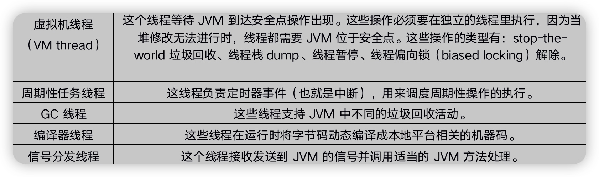


### JVM内存区域

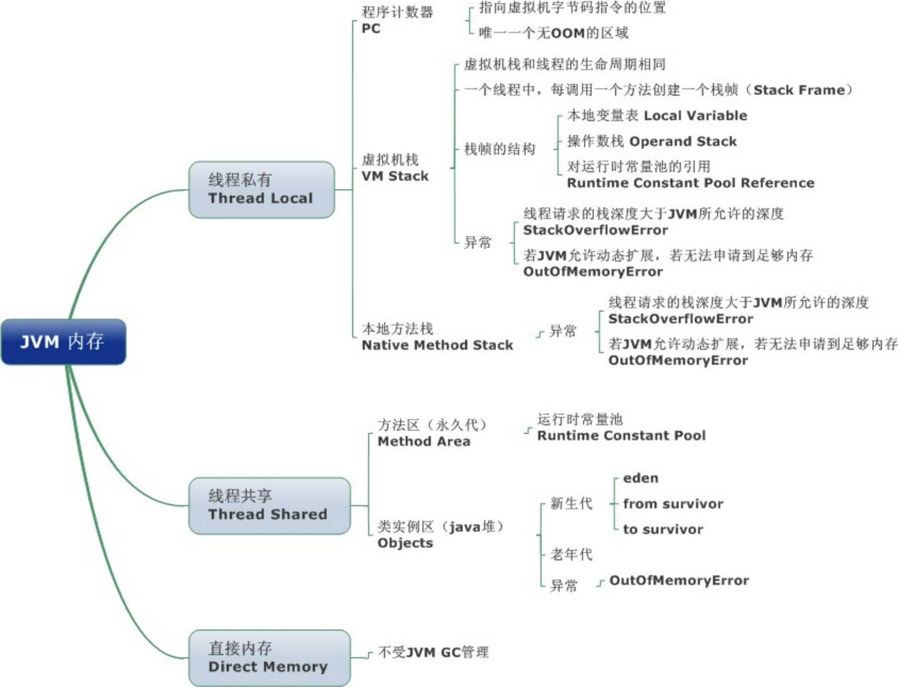

线程私有数据区域生命周期与线程相同, 依赖用户线程的启动/结束 而 创建/销毁(在 Hotspot VM 内, 每个线程都与操作系统的本地线程直接映射, 因此这部分内存区域的存/否跟随本地线程的生/死对应)。

线程共享区域随虚拟机的启动/关闭而创建/销毁。

直接内存并不是 JVM 运行时数据区的一部分, 但也会被频繁的使用: 在 JDK 1.4 引入的 NIO 提供了基于 Channel 与 Buffer 的 IO 方式, 它可以使用 Native 函数库直接分配堆外内存, 然后使用DirectByteBuffer 对象作为这块内存的引用进行操作(详见: Java I/O 扩展), 这样就避免了在 Java 堆和Native 堆中来回复制数据, 因此在一些场景中可以显著提高性能。

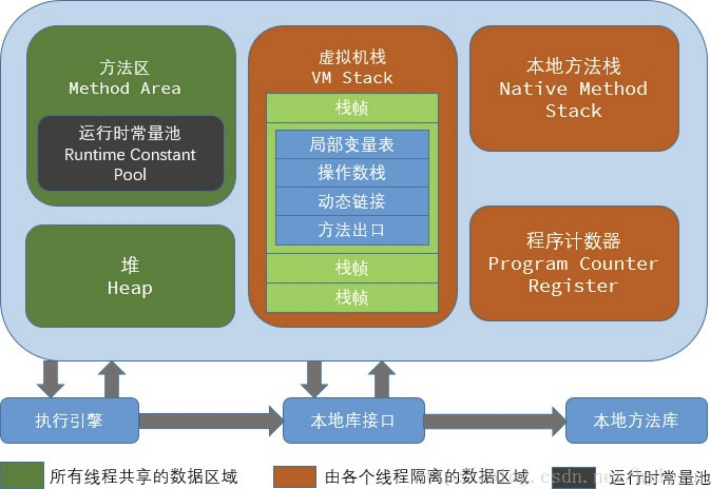


### jvm为什么要划分新生代、老年代?

JVM将堆内存划分为新生代和老年代的主要目的是为了优化垃圾回收的效率和内存的利用率。

1：对象的生命周期：大部分的对象在创建后很快就变得不可达，即被垃圾回收器标记并回收。因此，将新创建的对象放入新生代中，可以使得这些对象在经过几次垃圾回收后就被清理掉，减少了老年代的压力。

2：不同的垃圾回收算法：新生代和老年代的对象分别使用不同的垃圾回收算法。新生代通常使用复制算法，将新创建的对象放入 Eden 区，经过一次垃圾回收后存活的对象会被复制到 Survivor 区，多次垃圾回收后仍然存活的对象会被晋升到老年代。老年代通常使用标记-清除或标记-整理算法进行垃圾回收。

3：不同的垃圾回收频率：新生代的对象通常具有较短的生命周期，因此需要更频繁地进行垃圾回收。而老年代的对象具有较长的生命周期，因此进行垃圾回收的频率相对较低。将新生代和老年代分开管理可以根据对象的生命周期进行不同的垃圾回收策略，提高了垃圾回收的效率。

4：空间分配灵活性：新生代和老年代分开管理，可以根据应用程序的实际情况分配不同的大小和比例。例如，可以将新生代的大小设置较小以减少垃圾回收的时间，而将老年代的大小设置较大以减少内存碎片的产生。

综上所述，通过将堆内存划分为新生代和老年代，可以根据不同对象的生命周期、垃圾回收算法和频率进行优化，提高垃圾回收的效率和内存的利用率。

新生代一般暂用1/3空间

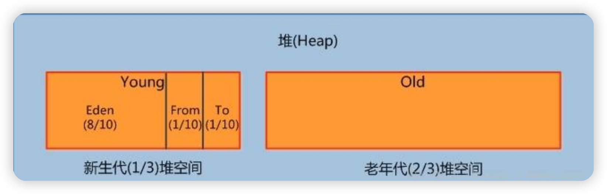


### MinorGC

Minor GC 的主要任务是回收新生代中的无用对象，释放掉那些已经不再被引用的对象，从而清理出内存空间，以供新的对象分配使用。Minor GC 使用的主要算法是复制算法（Copying Algorithm）。

复制算法的基本思想是将新生代划分为一个较大的Eden空间和两个较小的Survivor空间（通常称为From空间和To空间）。当Eden空间中的内存空间被占满时，会触发Minor GC。Minor GC 的过程包括以下几个步骤：

标记存活对象： 首先，GC会标记在Eden空间和Survivor空间中仍然存活的对象。

复制存活对象： 然后，GC会将存活的对象从Eden空间和一个Survivor空间（通常是From空间）复制到另一个Survivor空间（通常是To空间）。在复制过程中，对象在复制到To空间后的地址是连续的，这有助于避免碎片化。

清除无用对象： 完成复制后，Eden空间和From空间中的对象就可以被认为是无用的了。GC会清除这些无用对象，将整个Eden空间和From空间清空，为下一次对象分配腾出空间。

Survivor空间交换： 在清理后，From空间和To空间的角色会互换。即，From空间变成To空间，To空间变成From空间。这有助于避免内存浪费。

Minor GC 通常会比较快速，因为它只涉及到新生代中的对象。由于新生代中的大部分对象都是短暂的，所以 Minor GC 会频繁执行。为了避免过多的 Minor GC 导致应用程序的停顿时间增加，通常会根据情况进行调优，例如调整新生代的大小、调整对象晋升的条件等。

总之，Minor GC 是一种重要的垃圾回收操作，它通过回收新生代中的无用对象来保持堆内存的清洁，提高应用程序的性能。

### 怎么调整MinorGC

在JDK 1.8中，您可以通过以下参数来调整新生代（Young Generation）的大小：
-Xmn： 这个参数用来设置新生代的总大小。例如，-Xmn256m 表示将新生代设置为 256MB。
-XX:NewRatio： 这个参数用来设置新生代和老年代的比例。例如，-XX:NewRatio=2 表示新生代占堆内存的 1/3，老年代占堆内存的 2/3。
-XX:SurvivorRatio： 这个参数用来设置两个Survivor空间的大小比例。例如，-XX:SurvivorRatio=8 表示一个Survivor空间占新生代的 1/9。

这些参数可以通过在启动Java应用程序的命令行中添加来进行设置。例如：

```
java -Xmn256m -XX:NewRatio=2 -XX:SurvivorRatio=8 -jar YourApp.jar
```

请注意，调整新生代的大小可能会影响垃圾回收的性能和应用程序的响应时间。过小的新生代可能会导致频繁的Minor GC，而过大的新生代可能会导致较长的GC暂停。因此，在调整新生代大小时，您需要根据应用程序的性能特征和需求进行权衡和测试。

另外，JDK 1.8中的垃圾回收策略也可以通过参数进行调整，以优化性能。例如，使用 -XX:+UseParallelGC 或 -XX:+UseG1GC 可以选择不同的垃圾回收器，每个回收器有不同的性能特点。

记得在实际应用中，根据应用程序的需求和性能表现，逐步调整这些参数，进行性能测试和监控，以获得最佳的垃圾回收和内存管理配置。

### 老年代

老年代的主要目的是存放那些存活时间较长的对象，以便降低进行垃圾回收时的开销。由于垃圾回收操作通常会涉及遍历和标记对象，如果所有对象都放在一个堆内存中，那么垃圾回收将会变得非常耗时。将对象分为新生代和老年代可以根据其生命周期采用不同的垃圾回收策略，从而提高垃圾回收的效率。

以下是老年代的一些特点和用途：

存活时间较长的对象： 老年代通常存放那些存活时间较长的对象，这些对象经过多次Minor GC（新生代的垃圾回收）后仍然存活。这些对象可能是全局变量、持久化缓存、长时间的会话数据等。

垃圾回收策略： 老年代使用的垃圾回收策略通常是基于标记-清除、标记-整理等算法。这些算法能够更好地处理老年代中的大对象和存活时间较长的对象，以减少内存碎片化。

1：减少Full GC频率： Full GC（Full Garbage Collection）是指对整个堆内存进行垃圾回收，包括新生代和老年代。由于老年代中的对象生命周期较长，因此经常性的Full GC可能会导致较长的应用程序停顿。通过将老年代中的对象保持稳定，可以减少Full GC的频率，从而降低应用程序的停顿时间。

2：对象晋升： 新生代中的对象经过多次Minor GC后，如果仍然存活，就会被晋升到老年代。对象晋升的条件通常是对象的年龄达到一定阈值，例如默认情况下在Parallel GC中，对象的年龄达到15时会晋升到老年代。

3：GC暂停： 由于老年代中的垃圾回收通常涉及较大的对象，因此老年代的GC通常会比较耗时，导致较长的应用程序暂停。这就需要在应用程序的性能需求和响应时间之间进行平衡。

总之，老年代在JVM中起到了存放生命周期较长的对象并进行针对性的垃圾回收的作用。通过将对象分为新生代和老年代，JVM可以更好地管理内存，优化垃圾回收策略，从而提高Java应用程序的性能和稳定性。

### 永久代和元空间

在传统的Java虚拟机中（如Java 7及以前的版本），永久代用于存储类的元数据、方法信息、字符串常量池等。然而，永久代在实践中容易导致内存泄漏和垃圾回收性能问题。为了解决这些问题，Java 8引入了元空间。

元空间是一种与永久代不同的内存区域，它用于存储类的元数据信息。元空间使用的是本地内存（Native Memory），而不是虚拟机的堆内存。这种变化带来了以下好处：

1：避免内存泄漏 由于永久代的内存分配不受限制，如果应用程序不断加载大量的类，就可能导致永久代溢出。元空间使用本地内存，不会出现永久代的内存泄漏问题。

2：自动内存管理 元空间的大小默认是动态的，会根据需要自动调整。这意味着不再需要手动设置永久代的大小。

3：更好的垃圾回收性能 元空间的垃圾回收机制更加高效，不会像永久代一样频繁地进行Full GC。

请注意，元空间虽然解决了永久代的问题，但在使用时也需要注意以下几点：

元空间使用的本地内存可能会受到操作系统限制，因此需要根据应用程序的需求进行调整。
使用元空间的虚拟机参数可能与之前的永久代参数不同。例如，可以使用 -XX:MetaspaceSize 和 -XX:MaxMetaspaceSize 来调整元空间的大小。

### 垃圾回收

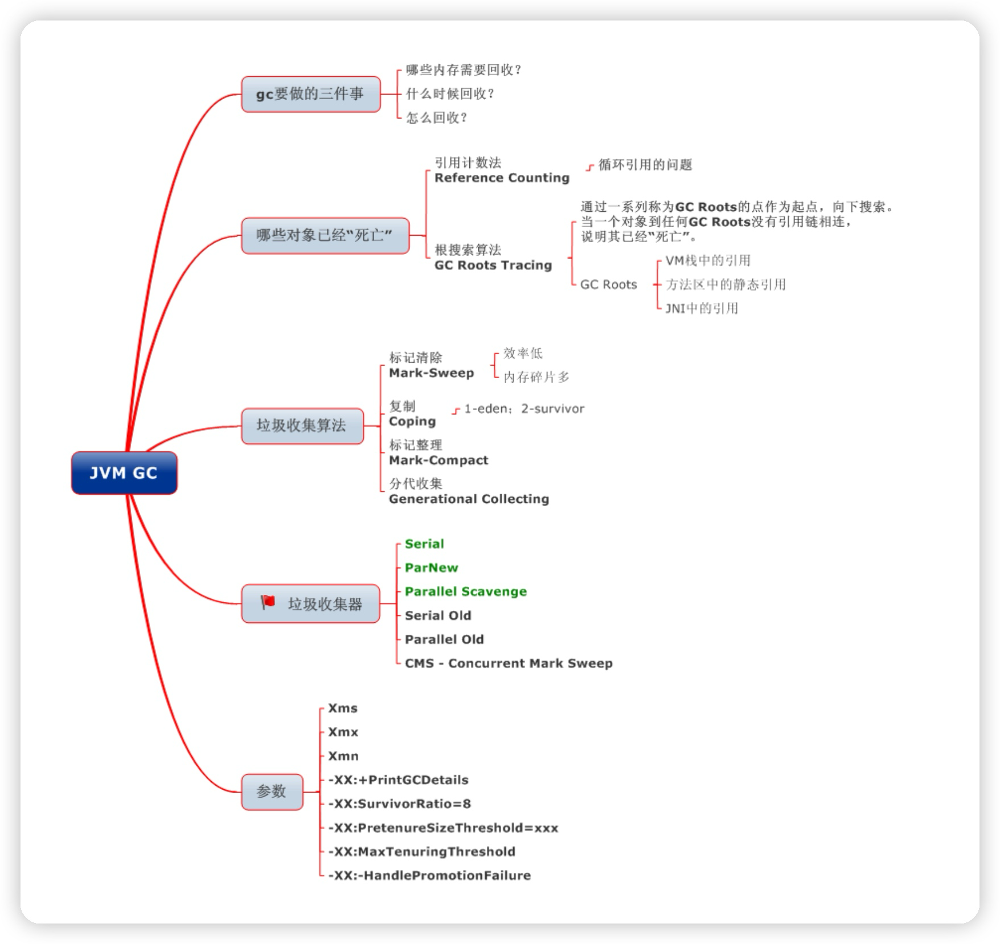

__如果确定是垃圾？__
1：引用计数法
2：可达性分析

__垃圾回收算法__

* 标记-清除（Mark-Sweep）算法：
  优点： 可以有效地回收不连续分布的内存空间，适用于处理大对象和大块无用空间。
  缺点： 会产生内存碎片，可能导致频繁的内存分配问题。同时，标记和清除过程可能会导致应用程序暂停，引起停顿时间。
* 标记-整理（Mark-Compact）算法：
  优点： 可以解决标记-清除算法产生的内存碎片问题，通过将存活的对象紧凑地移动到一侧，从而释放出连续的内存块。
  缺点： 与标记-清除一样，也会导致停顿时间，尤其在移动对象时。
* 复制（Copying）算法：
  优点： 避免了内存碎片问题，通过将存活对象复制到另一块空闲内存区域，然后清空原来的区域，使得内存空间始终是连续的。
  缺点： 需要额外的内存空间作为复制的目标，适用于新生代等内存较小的区域。
* 分代（Generational）算法：
  优点： 基于对象的生命周期将内存划分为不同的代，使得针对不同生命周期的对象采用不同的垃圾回收算法，提高了回收效率。
  缺点： 需要维护多个代之间的对象引用关系，可能增加垃圾回收的复杂性。
* 并发（Concurrent）算法：
  优点： 在垃圾回收的同时允许应用程序继续执行，减少停顿时间，提高了应用程序的响应性能。
  缺点： 由于需要与应用程序并发运行，可能会引入一些额外的开销，以及更复杂的实现和调优。
* 分区（Compacting）算法：
  优点： 在进行垃圾回收的同时，将存活对象移动到一侧，从而解决了内存碎片问题，并降低了堆内存的碎片化。
  缺点： 需要在内存移动过程中调整对象的引用，可能增加实现的复杂性。

一般新生代都采用复制算法

1. 解决内存碎片问题： 复制算法通过将存活的对象复制到另一块空闲内存区域，然后清空原来的区域，解决了内存碎片问题。由于新生代中的对象生命周期短暂，这种复制过程相对较快，不会对性能产生过大的影响。
2. 适应对象生命周期： 新生代中的大多数对象生命周期短，因此频繁进行垃圾回收是合理的。复制算法的核心思想是将新生代分为Eden空间和两个Survivor空间，以支持频繁的回收操作。
3. 连续内存分配： 复制算法将存活的对象紧凑地复制到一侧，从而保证内存空间始终是连续的，避免了内存碎片问题。

一般老年代都采用是标记-清除（Mark-Sweep）算法和标记-整理（Mark-Compact）算法。

JDK 1.8:
在 JDK 1.8 中，主要的垃圾回收器包括：

* Serial GC（Serial Garbage Collector）： 适用于单线程环境，采用复制算法和标记-整理算法，停顿时间相对较长，适用于较小的应用。
* Parallel GC（Parallel Garbage Collector）： 多线程的新生代垃圾回收器，采用复制算法。适用于多核CPU，能够提供更短的垃圾回收暂停时间。
* CMS GC（Concurrent Mark-Sweep Garbage Collector）： 并发的老年代垃圾回收器，采用标记-清除算法。通过在应用程序运行时并发地进行标记和清除，减少停顿时间。
* G1 GC（Garbage-First Garbage Collector）： 一种面向大堆的垃圾回收器，将堆分成多个区域，采用标记-整理和复制算法，可以自适应地调整垃圾回收策略，以平衡吞吐量和停顿时间。

默认的垃圾回收器：Parallel GC（Parallel Garbage Collector）。
新生代： 新生代采用的是 Parallel Scavenge 收集器，使用复制算法，目标是提高吞吐量。
老年代： 老年代采用的是 Serial Old 收集器，使用标记-整理算法，适用于单线程环境。

JDK 11:

* G1 GC（Garbage-First Garbage Collector）： 与 JDK 1.8 中的版本类似，但在 JDK 11 中有一些性能和稳定性的改进。
* ZGC（Z Garbage Collector）： 一种低延迟的垃圾回收器，适用于大堆和需要低停顿时间的应用。它可以在毫秒级别的停顿时间内执行垃圾回收。
* Shenandoah GC： 另一种低延迟的垃圾回收器，适用于需要快速响应的大型应用。与ZGC类似，它也在毫秒级别内执行垃圾回收。

默认的垃圾回收器是 G1 GC（Garbage-First Garbage Collector）
新生代： G1 GC 采用新的 G1 Young Generation，使用复制算法。
老年代： G1 GC 也用于老年代，使用标记-整理和复制算法来进行老年代的垃圾回收。

JDK 17:

* G1 GC（Garbage-First Garbage Collector）： JDK 17 中的 G1 垃圾回收器在性能和稳定性方面进行了一些改进。
* ZGC（Z Garbage Collector）： 与 JDK 11 中的版本类似，提供低延迟的垃圾回收能力。
* Shenandoah GC： 在 JDK 17 中继续提供低延迟的垃圾回收能力。

默认的垃圾回收器是 G1 GC。对于客户端类环境，
新生代： G1 GC 仍然采用 G1 Young Generation，使用复制算法。
老年代： G1 GC 在老年代中继续使用标记-整理和复制算法。

__怎么设置垃圾回收器__
-XX:+UseSerialGC
-XX:+UseParallelGC
-XX:+UseConcMarkSweepGC
-XX:+UseZGC
-XX:+UseShenandoahGC
java -XX:** -jar your_app.jar

### 引用类型

* 强引用（Strong Reference）：
  强引用是默认的引用类型，适用于大多数场景。例如，在创建对象时使用强引用，确保对象在程序需要时一直存在。

```
Object strongReference = new Object(); // 强引用
```

* 软引用（Soft Reference）：
  软引用适用于需要在内存不足时释放缓存的场景。例如，在实现缓存时，使用软引用来存储缓存对象，让垃圾回收器在内存紧张时回收不再使用的缓存。

```
SoftReference<CacheObject> softCache = new SoftReference<>(new CacheObject());
```

* 弱引用（Weak Reference）：
  弱引用适用于需要临时数据或辅助数据的场景。例如，在实现临时任务队列时，使用弱引用来存储任务对象，确保任务对象不会被过早地回收。

```
WeakReference<Task> weakTask = new WeakReference<>(new Task());
```

* 虚引用（Phantom Reference）：
  虚引用通常用于需要追踪对象被垃圾回收的场景。虚引用无法直接获取对象，但可以在对象被回收时执行特定操作。一个常见的使用案例是资源清理，如关闭文件句柄。

```
ReferenceQueue<FileResource> queue = new ReferenceQueue<>();
PhantomReference<FileResource> phantomRef = new PhantomReference<>(fileResource, queue);
// 当资源被垃圾回收时，执行资源释放操作
```

### IO/NIO

java中的I/O（输入/输出）和NIO（新I/O）是用于处理输入和输出操作的两种不同的编程模型。它们在处理数据的方式和性能方面有所不同。下面对Java I/O和NIO进行简要介绍：

* Java I/O（传统I/O）：

Java I/O是传统的输入/输出模型，它基于字节流（InputStream和OutputStream）和字符流（Reader和Writer）来进行数据的读写操作。Java I/O在处理数据时是以流（Stream）的形式逐字节或逐字符进行操作，适用于一些简单的I/O场景。然而，在处理大量数据时，Java I/O可能会导致性能问题，因为它在每次读写操作时都需要阻塞线程，直到操作完成。

* Java NIO（New I/O）：

Java NIO是一种新的I/O模型，引入了通道（Channel）和缓冲区（Buffer）的概念，以及非阻塞I/O操作。NIO提供了更灵活的方式来处理I/O操作，适用于需要高性能和并发处理的场景。NIO的核心组件包括：

通道（Channel）： 通道是NIO的基本构建块，它代表了一个可以读写数据的源或目标。通道可以与缓冲区进行交互，实现高效的数据传输。

缓冲区（Buffer）： 缓冲区是用于存储数据的容器，它可以用来读取数据和写入数据。缓冲区提供了不同的类型（字节缓冲区和字符缓冲区），并且可以更高效地与通道交互。

选择器（Selector）： 选择器用于实现非阻塞I/O操作。它允许一个线程管理多个通道的I/O操作，从而提高了应用程序的并发性能。

Java NIO还引入了非阻塞的I/O操作方式，通过选择器（Selector）来实现。选择器可以监视多个通道的I/O事件，并在就绪时通知应用程序进行处理，从而实现非阻塞的多路复用。这种方式允许一个线程处理多个通道的I/O，从而提高了并发处理的能力。

总之，Java I/O和NIO是用于处理输入/输出操作的两种不同编程模型，每种模型都适用于不同的场景。Java NIO在处理高性能、并发和非阻塞I/O方面具有优势，但也更复杂。选择哪种模型取决于应用程序的性能需求和特定的使用场景。

### JVM类加载机制

类加载的阶段： 类加载过程被分为以下几个阶段：

* 加载（Loading）： 将字节码文件加载到内存中。这一阶段由类加载器执行，负责查找字节码文件，并将其加载到JVM内存中。通常会从本地文件系统或网络中加载字节码。
* 链接（Linking）： 将已加载的类与其他类或资源进行关联和准备工作。链接阶段包括以下步骤：
* * 验证（Verification）： 验证字节码的合法性，确保它符合Java虚拟机规范。
* * 准备（Preparation）： 为类变量（静态变量）分配内存，并设置默认初始值。
* * 解析（Resolution）： 将符号引用转换为直接引用，即将类、字段和方法的符号引用解析为对应的内存地址。
* 初始化（Initialization）： 对类的静态变量进行初始化，执行类的静态代码块。初始化阶段由Java虚拟机执行，并在必要时按照指定的顺序保证类的初始化安全性。

类加载器（Class Loader）： 类加载器负责加载字节码文件，并创建类的Class对象。Java中有三个内置的类加载器层次结构：
启动类加载器（Bootstrap Class Loader）、
扩展类加载器（Extension Class Loader）、
应用程序类加载器（Application Class Loader）、
自定义类加载器： Java允许开发者自定义类加载器，从而实现更灵活的类加载策略。自定义类加载器可以用于加载特定位置的类文件，实现热部署、类的加密等需求。

双亲委派模型（Delegation Model）： Java的类加载机制采用了双亲委派模型，即类加载器在加载类时会优先委派给父类加载器加载。这种模型可以防止类的重复加载，保证类的隔离性和安全性。

### Arthas的热部署原理

功能基于Java虚拟机的Instrumentation机制，该机制允许在类被加载时进行字节码转换，从而实现动态修改类的功能。Arthas利用Instrumentation机制，通过在运行时注入修改过的字节码，来达到实时热部署的效果。

具体的原理如下：

* Instrumentation机制： Java提供了Instrumentation API，允许开发者在类加载过程中，通过修改字节码来实现对类的转换。Arthas通过Instrumentation API来动态修改已加载的类的字节码。
* 字节码修改： 当需要进行热部署时，Arthas会获取目标类的字节码，并对其进行修改。这些修改可以包括替换、插入、删除字节码指令，实现类的动态变更。
* 类的重新定义： 一旦字节码被修改，Arthas会调用Instrumentation的redefineClasses方法，将修改后的字节码重新定义到虚拟机中。这个过程会替换已加载的类的字节码，使得类的新代码生效。
*

尽管Arthas提供了这种热部署的功能，但在生产环境中的使用需要慎重考虑，因为动态修改类可能会引入不稳定性和难以调试的问题。

## 基础

### hashmap

jdk1.7 数组+链表
jdk1.8 数组+链表(长度超过8,转变成红黑树)

### LinkedHashMap

LinkedHashMap 是 HashMap 的一个子类，保存了记录的插入顺序，在用 Iterator 遍历
LinkedHashMap 时，先得到的记录肯定是先插入的，也可以在构造时带参数，按照访问次序排序。

### TreeMap

TreeMap 实现 SortedMap 接口，能够把它保存的记录根据键排序，默认是按键值的升序排序，
也可以指定排序的比较器，当用 Iterator遍历 TreeMap 时，得到的记录是排过序的。
如果使用排序的映射，建议使用 TreeMap。
在使用 TreeMap 时，key 必须实现 Comparable 接口或者在构造 TreeMap 传入自定义的
Comparator，否则会在运行时抛出 java.lang.ClassCastException 类型的异常。

### 线程安全的list

* CopyOnWriteArrayList： 这个类是java.util.concurrent包中的一个线程安全的List实现。它适用于读多写少的场景，因为写操作会在内部进行数组复制，因此写操作会比较昂贵。但读操作可以并发进行，不会出现数据竞争问题。
* Collections.synchronizedList： Java标准库中的Collections类提供了用于创建线程安全集合的工具方法。通过synchronizedList方法，你可以将一个普通的List转换为线程安全的。

### ConcurrentHashMap

ConcurrentHashMap 和 HashMap 思路是差不多的，但是因为它支持并发操作，所以要复杂一
些。整个 ConcurrentHashMap 由一个个 Segment 组成，Segment 代表”部分“或”一段"的
意思，所以很多地方都会将其描述为分段锁。

筒单理解就是，ConcurrentHashMap是一个 Segment 数组，Segment 通过继承
ReentrantLock 来进行加锁，所以每次需要加锁的操作锁住的是一个 segment，这样只要保证每
个 Segment 是线程安全的，也就实现了全局的线程安全。

jdk1.8 sg也采用的红黑树

### 反射

在 Java 中的反射机制是指在运行状态中，对于任意一个类都能够知道这个类所有的属性和方法；
并且对于任意一个对象，都能够调用它的任意一个方法；这种动态获取信息以及动态调用对象方
法的功能成为 Java 语言的反射机制。

__反射api__
反射 API 用来生成 JVM 中的类、接口或则对象的信息。

1. Class 类：反射的核心类，可以获取类的属性，方法等信息。
2. Field 类：Java.lang.reflec 包中的类，表示类的成员变量，可以用来获取和设置类之中的属性
   值。
3. Method 类： Java.lang.reflec 包中的类，表示类的方法，它可以用来获取类中的方法信息或
   者执行方法。
4. Constructor 类： Java.lang.reflec 包中的类，表示类的构造方法

__反射使用步骤(获取Class对象、调用对象方法）__

1. 获取想要操作的类的 Class 对象，他是反射的核心，通过 Class 对象我们可以任意调用类的方
   法。
2. 调用 Class 类中的方法，既就是反射的使用阶段。
3. 使用反射 API 来操作这些信息。

__获取Class对象的3种方法__

* 调用某个对象的 getClass()方法

```
Person p = new Person();
Class clazz = p.getClass();
```

* 调用某个类的class 属性来获取该类对应的 Class 对象

```
Class clazz = Person.class;
```

* 使用 Class 类中的 forName()静态方法(最安全/性能最好)

```
Class clazz = Class.forName("类的全路径"); (最常用)
```

### 注解

Java5.0 定义了 4 个标准的 meta-annotation 类型，它们被用来提供对其它 annotation 类型作说明。

* @Target 修饰的对象范围@Target说明了Annotation所修饰的对象范围： Annotation可被用于 packages、types（类、接口、枚举、Annotation 类型）、类型成员（方法、构造方法、成员变量、枚举值）、方法参数和本地变量（如循环变量、catch 参数）。在 Annotation 类型的声明中使用了 target 可更加明晰其修饰的目标
* @Retention 定义 被保留的时间长短Retention 定义了该 Annotation 被保留的时间长短：表示需要在什么级别保存注解信息，用于描述注解的生命周期（即：被描述的注解在什么范围内有效），取值（RetentionPoicy）有：
  SOURCE:在源文件中有效（即源文件保留）
  CLASS:在 class 文件中有效（即 class 保留）
  RUNTIME:在运行时有效（即运行时保留）
* @Documented 描述javadoc。@Documented 用于描述其它类型的annotation应该被作为被标注的程序成员的公共 API，因此可以被例如 javadoc 此类的工具文档化。
* @Inherited 阐述了某个被标注的类型是被继承的,@Inherited 元注解是一个标记注解。如果一个使用了@Inherited 修饰的 annotation 类型被用于一个 class，则这个 annotation 将被用于该class 的子类

### 内部类

内部类分为静态内部类，成员内部类，局部内部类，匿名内部类四种。

__静态内部类__

```
 public class Out {
     private static int a;
     private int b;
     public static class Inner {
         public void print() {
            System.out.println(a);
         }
     }
}
```

1. 静态内部类可以访问外部类所有的静态变量和方法，即使是 private 的也一样。
2. 静态内部类和一般类一致，可以定义静态变量、方法，构造方法等。
3. 其它类使用静态内部类需要使用“外部类.静态内部类”方式，如下所示：Out.Inner inner =
   new Out.Inner();inner.print();
4. 静态内部类的实例化不依赖于外部类的实例。可以通过外部类.静态内部类的方式来实例化静态内部类对象，而无需先创建外部类的实例。
5. Java集合类HashMap内部就有一个静态内部类Entry。Entry是HashMap存放元素的抽象，
   HashMap 内部维护 Entry 数组用了存放元素，但是 Entry 对使用者是透明的。像这种和外部
   类关系密切的，且不依赖外部类实例的，都可以使用静态内部类。

__成员内部类__
定义在类内部的非静态类，就是成员内部类。成员内部类不能定义静态方法和变量（final 修饰的
除外）。这是因为成员内部类是非静态的，类初始化的时候先初始化静态成员，如果允许成员内
部类定义静态变量，那么成员内部类的静态变量初始化顺序是有歧义的。

```
public class Out {
    private static int a;
    private int b;
  
    public class Inner {
        public void print() {
            System.out.println(a);
            System.out.println(b);
        }
    }
}
```

__局部内部类（定义在方法中的类）__
定义在方法中的类，就是局部类。如果一个类只在某个方法中使用，则可以考虑使用局部类。

```
public class Out {
    private static int a;
    private int b;
  
    public void test(final int c) {
        final int d = 1;
        class Inner {
            public void print() {
                System.out.println(c);
            }
        }
    }
}
```

__匿名内部类__
匿名内部类我们必须要继承一个父类或者实现一个接口，当然也仅能只继承一个父类或者实现一个接口。同时它也是没有 class 关键字，这是因为匿名内部类是直接使用 new 来生成一个对象的引用。

```
public abstract class Bird {
    private String name;
    public String getName() {
        return name;
    }
  
    public void setName(String name) {
        this.name = name;
    }
    public abstract int fly();
}
  
public class Test {
    public void test(Bird bird){
        System.out.println(bird.getName() + "能够飞 " + bird.fly() + "米");
    }
  
    public static void main(String[] args) {
        Test test = new Test();
        test.test(new Bird() {
            public int fly() {
                return 10000;
            }
  
            public String getName() {
                return "大雁";
            }
        });
    }
}
```

### 泛型

Java中的泛型是一种参数化类型的概念，它允许我们在定义类、接口和方法时使用一个或多个类型参数，以实现代码的重用和类型安全。

泛型的主要目的是提供编译时类型安全，避免在运行时出现类型转换错误，并提供更强的代码可读性和可维护性。

在Java中，泛型主要有以下几个关键概念：

* 类型参数：在定义类、接口或方法时，可以使用类型参数来表示一个或多个占位符类型。类型参数通常用大写字母表示，如T、E、K等。
* 泛型类：使用类型参数的类称为泛型类。通过在类名后面加上<T>来定义一个泛型类，其中T是类型参数。例如：class MyClass<T> { }。
* 泛型接口：与泛型类类似，使用类型参数的接口称为泛型接口。例如：interface MyInterface<T> { }。
* 泛型方法：使用类型参数的方法称为泛型方法。通过在方法返回类型前面加上<T>来定义一个泛型方法。例如：<T> void myMethod(T item) { }。
* 通配符：通配符用于限制泛型类型的范围。?表示任意类型，? extends T表示T的子类，? super T表示T的父类。通配符可以用在泛型类、泛型方法和泛型接口中。
* 类型擦除：Java中的泛型是通过类型擦除来实现的，即在编译时会将泛型类型擦除为原始类型。这意味着在运行时无法获取泛型的具体类型参数信息。

__与object的区别__

* 类型安全性：泛型提供了编译时的类型检查，可以在编译时捕获类型错误，从而提供更强的类型安全性。而Object不提供编译时的类型检查，只有在运行时才会发现类型错误，容易导致类型转换异常。
* 类型转换：使用泛型可以避免显式的类型转换，编译器会自动插入必要的类型转换代码。而在使用Object时，需要手动进行类型转换，容易引入类型转换错误。
* 代码的可读性和可维护性：泛型使代码更加清晰和易懂，可以提供更好的代码可读性和可维护性。通过使用泛型，我们可以在编写代码时明确指定操作的类型，而不是使用Object来处理所有类型的对象。
* 集合的类型安全性：泛型可以应用于集合类，提供了类型安全的集合操作。通过使用泛型集合，可以在编译时检查元素类型的一致性，并避免在运行时出现类型转换错误。而使用Object作为集合元素类型，需要进行手动类型转换，并且无法在编译时检查类型的一致性。
* 代码重用性：通过使用泛型，可以编写更通用的代码，实现更高的代码重用性。泛型类和方法可以适用于多种类型，而不需要重复编写相似的代码。而使用Object，需要手动进行类型转换和处理，代码重用性较低。

需要注意的是，泛型和Object并不是完全相互替代的。在某些情况下，我们仍然需要使用Object来处理不确定或未知类型的对象。例如，当我们需要在一个集合中存储不同类型的对象时，可以使用Object类型作为通用的容器类型。但是，应该尽量避免在需要确定类型的场景中使用Object，而是使用泛型来提供更好的类型安全性和代码可读性。

### java对象复制

* 浅拷贝（Shallow Copy）：浅拷贝是指创建一个新对象，然后将原对象的值或引用复制到新对象中。这意味着新对象和原对象共享同一块内存，对其中一个对象的修改会影响到另一个对象。在Java中，可以通过实现Cloneable接口和重写clone()方法来实现浅拷贝。

```
class MyClass implements Cloneable {
    private int value;

    public MyClass(int value) {
        this.value = value;
    }

    public void setValue(int value) {
        this.value = value;
    }

    public int getValue() {
        return value;
    }

    @Override
    public Object clone() throws CloneNotSupportedException {
        return super.clone();
    }
}

public class ShallowCopyExample {
    public static void main(String[] args) throws CloneNotSupportedException {
        MyClass obj1 = new MyClass(10);
        MyClass obj2 = (MyClass) obj1.clone();

        System.out.println(obj1.getValue());  // 输出：10
        System.out.println(obj2.getValue());  // 输出：10

        obj2.setValue(20);

        System.out.println(obj1.getValue());  // 输出：20，修改obj2的值也影响到了obj1
        System.out.println(obj2.getValue());  // 输出：20
    }
}

```

* 深拷贝（Deep Copy）：深拷贝是指创建一个新对象，并且复制原对象的所有值到新对象中。这意味着新对象与原对象完全独立，对其中一个对象的修改不会影响到另一个对象。在Java中，可以通过实现Serializable接口并使用序列化/反序列化来实现深拷贝，或者使用第三方库如Apache Commons Lang中的SerializationUtils类实现深拷贝。

```
import org.apache.commons.lang3.SerializationUtils;

class MyClass implements Serializable {
    private int value;

    public MyClass(int value) {
        this.value = value;
    }

    public void setValue(int value) {
        this.value = value;
    }

    public int getValue() {
        return value;
    }
}

public class DeepCopyExample {
    public static void main(String[] args) {
        MyClass obj1 = new MyClass(10);
        MyClass obj2 = SerializationUtils.clone(obj1);

        System.out.println(obj1.getValue());  // 输出：10
        System.out.println(obj2.getValue());  // 输出：10

        obj2.setValue(20);

        System.out.println(obj1.getValue());  // 输出：10，修改obj2的值不会影响到obj1
        System.out.println(obj2.getValue());  // 输出：20
    }
}

```

## 多线程

### 创建多线程

* 继承 Thread 类

```
public class MyThread extends Thread { 
    public void run() { 
        System.out.println("MyThread.run()"); 
    } 
}

MyThread myThread1 = new MyThread(); 
myThread1.start();
```

* 实现 Runnable 接口

```
public class MyThread extends OtherClass implements Runnable { 
    public void run() { 
        System.out.println("MyThread.run()"); 
    } 
}
```

* 线程池 Java 里面线程池的顶级接口是 Executor，但是严格意义上讲 Executor 并不是一个线程池，而只是一个执行线程的工具。真正的线程池接口是 ExecutorService

### 有返回值的线程

有返回值的任务必须实现 Callable 接口，类似的，无返回值的任务必须 Runnable 接口。执行
Callable 任务后，可以获取一个 Future 的对象，在该对象上调用 get 就可以获取到 Callable 任务。

### 线程池的submit方法和Future的get方法

* submit方法：线程池中的任务可以通过submit方法提交。这个方法返回一个Future对象，表示任务的未来结果。submit方法会立即返回，不会等待任务执行完毕。
* get方法：Future接口提供了get方法，可以用来获取任务的结果。如果任务尚未完成，调用get方法会阻塞当前线程，直到任务完成并返回结果。如果任务已经完成，get方法会立即返回结果。

### Thread类的join方法

Thread类的join方法允许一个线程等待另一个线程的完成。当一个线程调用另一个线程的join方法时，它将会等待目标线程执行完毕，然后再继续执行。这种方式可以用来实现线程之间的同步。

### 线程池

* newFixedThreadPool: 创建一个可重用固定线程数的线程池，以共享的无界队列方式来运行这些线程。
* newScheduledThreadPool: 它可安排在给定延迟后运行命令或者定期地执行.

```
ScheduledExecutorService scheduledThreadPool= Executors.newScheduledThreadPool(3); 

scheduledThreadPool.schedule(newRunnable(){ 
     @Override 
     public void run() {
         System.out.println("延迟三秒");
         }
     }, 3, TimeUnit.SECONDS);
   
scheduledThreadPool.scheduleAtFixedRate(newRunnable(){ 
     @Override 
     public void run() {
        System.out.println("延迟 1 秒后每三秒执行一次");
     }
 },1,3,TimeUnit.SECONDS)
```

* newSingleThreadExecutor：返回一个线程池（这个线程池只有一个线程）,这个线程池可以在线程死后（或发生异常时）重新启动一个线程来替代原来的线程继续执行下去

__参数__

1. corePoolSize：指定了线程池中的线程数量。
2. maximumPoolSize：指定了线程池中的最大线程数量。
3. keepAliveTime：当前线程池数量超过 corePoolSize 时，多余的空闲线程的存活时间，即多
   次时间内会被销毁。
4. unit：keepAliveTime 的单位。
5. workQueue：任务队列，被提交但尚未被执行的任务。
6. threadFactory：线程工厂，用于创建线程，一般用默认的即可。
7. handler：拒绝策略，当任务太多来不及处理，如何拒绝任务。

* AbortPolicy ： 直接抛出异常，阻止系统正常运行。
* CallerRunsPolicy ： 只要线程池未关闭，该策略直接在调用者线程中，运行当前被丢弃的
  任务。显然这样做不会真的丢弃任务，但是，任务提交线程的性能极有可能会急剧下降。
* DiscardOldestPolicy ： 丢弃最老的一个请求，也就是即将被执行的一个任务，并尝试再
  次提交当前任务。
* DiscardPolicy ： 该策略默默地丢弃无法处理的任务，不予任何处理。如果允许任务丢
  失，这是最好的一种方案。
  以上内置拒绝策略均实现了 RejectedExecutionHandler 接口，若以上策略仍无法满足实际
  需要，完全可以自己扩展 RejectedExecutionHandler 接口。
* 自定义

### 线程生命周期

* 新建(New)
* 就绪（Runnable）：当线程对象调用了 start()方法之后，该线程处于就绪状态。Java 虚拟机会为其创建方法调用栈和程序计数器，等待调度运行。
* 运行（Running）
* 阻塞(Blocked)：
* * 阻塞状态是指线程因为某种原因放弃了 cpu 使用权，也即让出了 cpu timeslice，暂时停止运行。
    直到线程进入可运行(runnable)状态，才有机会再次获得 cpu timeslice 转到运行(running)状
    态。阻塞的情况分三种：
* * * 等待阻塞（o.wait->等待对列）：
      运行(running)的线程执行 o.wait()方法，JVM 会把该线程放入等待队列(waitting queue)
      中。
* * * 同步阻塞(lock->锁池)
      运行(running)的线程在获取对象的同步锁时，若该同步锁被别的线程占用，则 JVM 会把该线
      程放入锁池(lock pool)中。
* * * 其他阻塞(sleep/join)
      运行(running)的线程执行 Thread.sleep(long ms)或 t.join()方法，或者发出了 I/O 请求时，
      JVM 会把该线程置为阻塞状态。当 sleep()状态超时、join()等待线程终止或者超时、或者 I/O
      处理完毕时，线程重新转入可运行(runnable)状态。
* 死亡(Dead)线程会以下面三种方式结束，结束后就是死亡状态。
* * 正常结束 run()或 call()方法执行完成，线程正常结束。
* * 异常结束 线程抛出一个未捕获的 Exception 或 Error。
* * 调用 stop 直接调用该线程的 stop()方法来结束该线程—该方法通常容易导致死锁，不推荐使用。

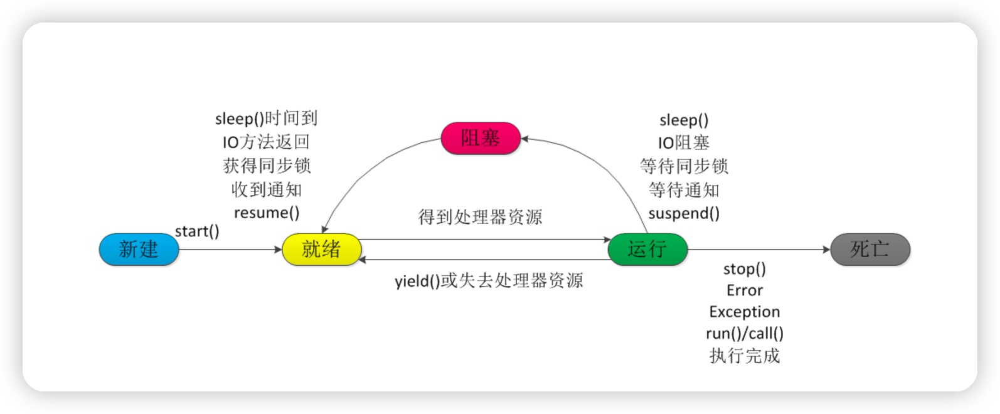

### 线程基本方法

线程相关的基本方法有 wait，notify，notifyAll，sleep，join，yield 等


* 线程等待（wait）
  调用该方法的线程进入 WAITING 状态，只有等待另外线程的通知或被中断才会返回，需要注意的是调用wait()方法后，会释放对象的锁。因此，wait 方法一般用在同步方法或同步代码块中。
* 线程睡眠（sleep）
  sleep 导致当前线程休眠，与 wait 方法不同的是 sleep 不会释放当前占有的锁,sleep(long)会使
  线程进入 TIMED-WATING 状态，而 wait()方法会导致当前线程进入 WATING 状态
* 线程让步（yield）
  yield 会使当前线程让出 CPU 执行时间片，与其他线程一起重新竞争 CPU 时间片。一般情况下，
  优先级高的线程有更大的可能性成功竞争得到 CPU 时间片，但这又不是绝对的，有的操作系统对
  线程优先级并不敏感。
* 线程中断（interrupt）
  中断一个线程，其本意是给这个线程一个通知信号，会影响这个线程内部的一个中断标识位。这
  个线程本身并不会因此而改变状态(如阻塞，终止等)。
* Join 等待其他线程终止
  join() 方法，等待其他线程终止，在当前线程中调用一个线程的 join() 方法，则当前线程转为阻塞
  状态，回到另一个线程结束，当前线程再由阻塞状态变为就绪状态，等待 cpu 的宠幸。

举例：很多情况下，主线程生成并启动了子线程，需要用到子线程返回的结果，也就是需要主线程需要
在子线程结束后再结束，这时候就要用到 join() 方法

```
public class JoinExample {
    public static void main(String[] args) {
        Thread childThread1 = new Thread(() -> {
            try {
                System.out.println("Child Thread 1 is starting...");
                Thread.sleep(2000);
                System.out.println("Child Thread 1 is done.");
            } catch (InterruptedException e) {
                e.printStackTrace();
            }
        });

        Thread childThread2 = new Thread(() -> {
            try {
                System.out.println("Child Thread 2 is starting...");
                Thread.sleep(3000);
                System.out.println("Child Thread 2 is done.");
            } catch (InterruptedException e) {
                e.printStackTrace();
            }
        });

        childThread1.start();
        childThread2.start();

        System.out.println("Main Thread is waiting for child threads to finish...");

        try {
            childThread1.join(); // Main thread waits for childThread1 to finish
            childThread2.join(); // Main thread waits for childThread2 to finish
        } catch (InterruptedException e) {
            e.printStackTrace();
        }

        System.out.println("Main Thread is done.");
    }
}
```

* 线程唤醒（notify）
  Object 类中的 notify() 方法，唤醒在此对象监视器上等待的单个线程，如果所有线程都在此对象
  上等待，则会选择唤醒其中一个线程，选择是任意的，并在对实现做出决定时发生，线程通过调
  用其中一个 wait() 方法，在对象的监视器上等待，直到当前的线程放弃此对象上的锁定，才能继
  续执行被唤醒的线程，被唤醒的线程将以常规方式与在该对象上主动同步的其他所有线程进行竞
  争。类似的方法还有 notifyAll() ，唤醒再次监视器上等待的所有线程。

```
public class NotifyExample {
    public static void main(String[] args) {
        Object lock = new Object();

        Thread waitingThread = new Thread(() -> {
            synchronized (lock) {
                try {
                    System.out.println("Waiting thread is waiting...");
                    lock.wait(); // Release the lock and wait
                    System.out.println("Waiting thread is awake.");
                } catch (InterruptedException e) {
                    e.printStackTrace();
                }
            }
        });

        Thread notifyingThread = new Thread(() -> {
            synchronized (lock) {
                try {
                    System.out.println("Notifying thread is sleeping...");
                    Thread.sleep(2000); // Simulating some work
                    lock.notify(); // Notify the waiting thread
                    System.out.println("Notifying thread is done.");
                } catch (InterruptedException e) {
                    e.printStackTrace();
                }
            }
        });

        waitingThread.start();
        notifyingThread.start();

        try {
            waitingThread.join();
            notifyingThread.join();
        } catch (InterruptedException e) {
            e.printStackTrace();
        }
    }
}

```

notify 方法只会唤醒等待在同一个对象上的一个线程，具体是哪个线程是不确定的。如果有多个线程在等待，只有其中一个会被唤醒。
notify 方法必须在同步代码块中（使用相同的锁对象）调用，以确保线程安全。
wait 和 notify 方法应该在合适的同步块中调用，以免出现死锁等问题。在实际应用中，notify 和 wait 经常与其他线程同步机制一起使用，以实现更复杂的线程间协调。

### Interrupt 方法结束线程

使用 interrupt()方法来中断线程有两种情况：

1. 线程处于阻塞状态：如使用了 sleep,同步锁的 wait,socket 中的 receiver,accept 等方法时，会使线程处于阻塞状态。当调用线程的 interrupt()方法时，会抛出 InterruptException 异常。阻塞中的那个方法抛出这个异常，通过代码捕获该异常，然后 break 跳出循环状态，从而让我们有机会结束这个线程的执行。通常很多人认为只要调用 interrupt 方法线程就会结束，实际上是错的， 一定要先捕获 InterruptedException 异常之后通过 break 来跳出循环，才能正常结束 run 方法。
2. 线程未处于阻塞状态：使用 isInterrupted()判断线程的中断标志来退出循环。当使用
   interrupt()方法时，中断标志就会置 true，和使用自定义的标志来控制循环是一样的道理。

```
public class ThreadSafe extends Thread {
     public void run() { 
         while (!isInterrupted()){ //非阻塞过程中通过判断中断标志来退出
             try{
                Thread.sleep(5*1000);//阻塞过程捕获中断异常来退出
             }catch(InterruptedException e){
                e.printStackTrace();
                break;//捕获到异常之后，执行 break 跳出循环
             }
         }
     } 
}
```

### stop 方法终止线程（线程不安全）

程序中可以直接使用 thread.stop()来强行终止线程，但是 stop 方法是很危险的，就象突然关
闭计算机电源，而不是按正常程序关机一样，可能会产生不可预料的结果，不安全主要是：
thread.stop()调用之后，创建子线程的线程就会抛出 ThreadDeatherror 的错误，并且会释放子
线程所持有的所有锁。一般任何进行加锁的代码块，都是为了保护数据的一致性，如果在调用
thread.stop()后导致了该线程所持有的所有锁的突然释放(不可控制)，那么被保护数据就有可能呈
现不一致性，其他线程在使用这些被破坏的数据时，有可能导致一些很奇怪的应用程序错误。因
此，并不推荐使用 stop 方法来终止线程。

### sleep 与 wait 区别

* 对于 sleep()方法，我们首先要知道该方法是属于 Thread 类中的。而 wait()方法，则是属于
  Object 类中的。
* sleep()方法导致了程序暂停执行指定的时间，让出 cpu 该其他线程，但是他的监控状态依然
  保持者，当指定的时间到了又会自动恢复运行状态。在调用 sleep()方法的过程中，线程不会释放对锁。
* 而当调用 wait()方法的时候，线程会放弃对象锁，进入等待此对象的等待锁定池，只有针对此
  对象调用 notify()方法后本线程才进入对象锁定池准备获取对象锁进入运行状态。
* 唤醒机制
  sleep：sleep 方法会在指定的时间过后自动唤醒，无需其他线程的干预。
  wait：wait 方法需要在另一个线程中调用相同对象的 notify 或 notifyAll 方法来唤醒等待的线程。
* 异常抛出
  sleep：sleep 方法可能会抛出 InterruptedException，需要在方法上捕获或抛出该异常。
  wait：wait 方法必须在 synchronized 块中使用，同时需要处理 InterruptedException。

### start 与 run 区别

* start 方法：
  start 是 Thread 类的方法，用于启动一个新的线程。当调用 start 方法时，会创建一个新的线程，并在新线程中调用该线程对象的 run 方法。新线程会与主线程（或调用 start 方法的线程）并发运行，独立于主线程。
* run 方法：
  run 也是 Thread 类的方法，用于定义线程的任务代码。run 方法中包含线程要执行的代码逻辑。如果直接调用 run 方法，它会在当前线程中执行，不会创建新的线程。

### 乐观锁

乐观锁是一种乐观思想，即认为读多写少，遇到并发写的可能性低，每次去拿数据的时候都认为
别人不会修改，所以不会上锁，但是在更新的时候会判断一下在此期间别人有没有去更新这个数
据，采取在写时先读出当前版本号，然后加锁操作（比较跟上一次的版本号，如果一样则更新），
如果失败则要重复读-比较-写的操作。

java 中的乐观锁基本都是通过 CAS 操作实现的，CAS 是一种更新的原子操作，比较当前值跟传入
值是否一样，一样则更新，否则失败。

### CAS

CAS（Compare And Swap/Set）比较并交换，CAS 算法的过程是这样：它包含 3 个参数
CAS(V,E,N)。V 表示要更新的变量(内存值)，E 表示预期值(旧的)，N 表示新值。当且仅当 V 值等
于 E 值时，才会将 V 的值设为 N，如果 V 值和 E 值不同，则说明已经有其他线程做了更新，则当
前线程什么都不做。最后，CAS 返回当前 V 的真实值。
CAS 操作是抱着乐观的态度进行的(乐观锁)，它总是认为自己可以成功完成操作。当多个线程同时
使用 CAS 操作一个变量时，只有一个会胜出，并成功更新，其余均会失败。失败的线程不会被挂
起，仅是被告知失败，并且允许再次尝试，当然也允许失败的线程放弃操作。基于这样的原理，
CAS 操作即使没有锁，也可以发现其他线程对当前线程的干扰，并进行恰当的处理。由于一般 CPU 切
换时间比 CPU 指令集操作更加长，所以性能有提升。

CAS 会导致“ABA 问题”。CAS 算法实现一个重要前提需要取出内存中某时刻的数据，而在下时
刻比较并替换，那么在这个时间差类会导致数据的变化。
比如说一个线程 one 从内存位置 V 中取出 A，这时候另一个线程 two 也从内存中取出 A，并且
two 进行了一些操作变成了 B，然后 two 又将 V 位置的数据变成 A，这时候线程 one 进行 CAS 操
作发现内存中仍然是 A，然后 one 操作成功。尽管线程 one 的 CAS 操作成功，但是不代表这个过
程就是没有问题的。
部分乐观锁的实现是通过版本号（version）的方式来解决 ABA 问题，乐观锁每次在执行数据的修
改操作时，都会带上一个版本号，一旦版本号和数据的版本号一致就可以执行修改操作并对版本
号执行+1 操作，否则就执行失败。因为每次操作的版本号都会随之增加，所以不会出现 ABA 问
题，因为版本号只会增加不会减少。

### AQS

AbstractQueuedSynchronizer 类如其名，抽象的队列式的同步器，AQS 定义了一套多线程访问
共享资源的同步器框架，许多同步类实现都依赖于它，如常用的:ReentrantLock/Semaphore/CountDownLatch。

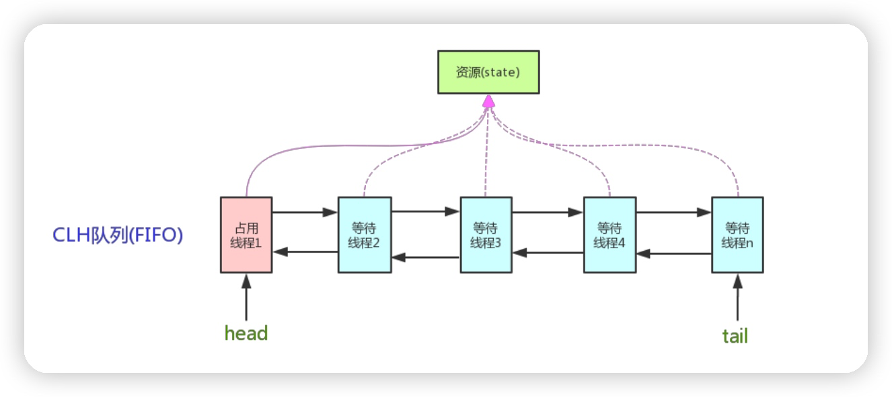


它维护了一个 volatile int state（代表共享资源）和一个 FIFO 线程等待队列（多线程争用资源被
阻塞时会进入此队列）。这里 volatile 是核心关键词，具体 volatile 的语义，在此不述。state 的
访问方式有三种:
getState()
setState()
compareAndSetState()

__AQS 定义两种资源共享方式__
Exclusive 独占资源-ReentrantLock
Exclusive（独占，只有一个线程能执行，如 ReentrantLock）

Share 共享资源-Semaphore/CountDownLatch
Share（共享，多个线程可同时执行，如 Semaphore/CountDownLatch）。

AQS 只是一个框架，具体资源的获取/释放方式交由自定义同步器去实现，AQS 这里只定义了一个
接口，具体资源的获取交由自定义同步器去实现了（通过 state 的 get/set/CAS)之所以没有定义成
abstract ，是因为独占模式下只用实现 tryAcquire-tryRelease ，而共享模式下只用实现
tryAcquireShared-tryReleaseShared。如果都定义成abstract，那么每个模式也要去实现另一模
式下的接口。不同的自定义同步器争用共享资源的方式也不同。自定义同步器在实现时只需要实
现共享资源 state 的获取与释放方式即可，至于具体线程等待队列的维护（如获取资源失败入队/
唤醒出队等），AQS 已经在顶层实现好了。

自定义同步器实现时主要实现以下几种方法：
1．isHeldExclusively()：该线程是否正在独占资源。只有用到 condition 才需要去实现它。
2．tryAcquire(int)：独占方式。尝试获取资源，成功则返回 true，失败则返回 false。
3．tryRelease(int)：独占方式。尝试释放资源，成功则返回 true，失败则返回 false。
4．tryAcquireShared(int)：共享方式。尝试获取资源。负数表示失败；0 表示成功，但没有剩余
可用资源；正数表示成功，且有剩余资源。
5．tryReleaseShared(int)：共享方式。尝试释放资源，如果释放后允许唤醒后续等待结点返回
true，否则返回 false。

同步器的实现是 ABS 核心（state 资源状态计数）
同步器的实现是 ABS 核心，以 ReentrantLock 为例，state 初始化为 0，表示未锁定状态。A 线程lock()时，会调用 tryAcquire()独占该锁并将 state+1。此后，其他线程再 tryAcquire()时就会失败，直到 A 线程 unlock()到 state=0（即释放锁）为止，其它线程才有机会获取该锁。当然，释放锁之前，A 线程自己是可以重复获取此锁的（state 会累加），这就是可重入的概念。但要注意，获取多少次就要释放多么次，这样才能保证 state 是能回到零态的。

以 CountDownLatch 以例，任务分为 N 个子线程去执行，state 也初始化为 N（注意 N 要与
线程个数一致）。这 N 个子线程是并行执行的，每个子线程执行完后 countDown()一次，state
会 CAS 减 1。等到所有子线程都执行完后(即 state=0)，会 unpark()主调用线程，然后主调用线程
就会从 await()函数返回，继续后余动作。

ReentrantReadWriteLock 实现独占和共享两种方式
一般来说，自定义同步器要么是独占方法，要么是共享方式，他们也只需实tryAcquiretryRelease、tryAcquireShared-tryReleaseShared 中的一种即可。但 AQS也支持自定义同步器,同时实现独占和共享两种方式，如 ReentrantReadWriteLock。

### 悲观锁

悲观锁是就是悲观思想，即认为写多，遇到并发写的可能性高，每次去拿数据的时候都认为别人
会修改，所以每次在读写数据的时候都会上锁，这样别人想读写这个数据就会 block 直到拿到锁。
java中的悲观锁就是Synchronized,AQS框架下的锁则是先尝试cas乐观锁去获取锁，获取不到，
才会转换为悲观锁，如 RetreenLock。

### 自旋锁

自旋锁原理非常简单，如果持有锁的线程能在很短时间内释放锁资源，那么那些等待竞争锁
的线程就不需要做内核态和用户态之间的切换进入阻塞挂起状态，它们只需要等一等（自旋），
等持有锁的线程释放锁后即可立即获取锁，这样就避免用户线程和内核的切换的消耗。

线程自旋是需要消耗 cup 的，说白了就是让 cup 在做无用功，如果一直获取不到锁，那线程
也不能一直占用 cup 自旋做无用功，所以需要设定一个自旋等待的最大时间。

如果持有锁的线程执行的时间超过自旋等待的最大时间扔没有释放锁，就会导致其它争用锁
的线程在最大等待时间内还是获取不到锁，这时争用线程会停止自旋进入阻塞状态。

* 自旋锁的优缺点
  自旋锁尽可能的减少线程的阻塞，这对于锁的竞争不激烈，且占用锁时间非常短的代码块来
  说性能能大幅度的提升，因为自旋的消耗会小于线程阻塞挂起再唤醒的操作的消耗，这些操作会
  导致线程发生两次上下文切换！
  但是如果锁的竞争激烈，或者持有锁的线程需要长时间占用锁执行同步块，这时候就不适合
  使用自旋锁了，因为自旋锁在获取锁前一直都是占用 cpu 做无用功，占着 XX 不 XX，同时有大量
  线程在竞争一个锁，会导致获取锁的时间很长，线程自旋的消耗大于线程阻塞挂起操作的消耗，
  其它需要 cup 的线程又不能获取到 cpu，造成 cpu 的浪费。所以这种情况下我们要关闭自旋锁
* 自旋锁时间阈值（1.6 引入了适应性自旋锁）
  自旋锁的目的是为了占着 CPU 的资源不释放，等到获取到锁立即进行处理。但是如何去选择
  自旋的执行时间呢？如果自旋执行时间太长，会有大量的线程处于自旋状态占用 CPU 资源，进而
  会影响整体系统的性能。因此自旋的周期选的额外重要！

JVM 对于自旋周期的选择，jdk1.5 这个限度是一定的写死的，在 1.6 引入了适应性自旋锁，适应
性自旋锁意味着自旋的时间不在是固定的了，而是由前一次在同一个锁上的自旋时间以及锁的拥
有者的状态来决定，基本认为一个线程上下文切换的时间是最佳的一个时间，同时 JVM 还针对当
前 CPU 的负荷情况做了较多的优化，如果平均负载小于 CPUs 则一直自旋，如果有超过(CPUs/2)
个线程正在自旋，则后来线程直接阻塞，如果正在自旋的线程发现 Owner 发生了变化则延迟自旋
时间（自旋计数）或进入阻塞，如果 CPU 处于节电模式则停止自旋，自旋时间的最坏情况是 CPU
的存储延迟（CPU A 存储了一个数据，到 CPU B 得知这个数据直接的时间差），自旋时会适当放
弃线程优先级之间的差异。

* 自旋锁的开启
  JDK1.6 中-XX:+UseSpinning 开启；
  -XX:PreBlockSpin=10 为自旋次数；
  JDK1.7 后，去掉此参数，由 jvm 控制；

### Synchronized

synchronized 它可以把任意一个非 NULL 的对象当作锁。他属于独占式的悲观锁，同时属于可重
入锁

__Synchronized 作用范围__

1. 作用于方法时，锁住的是对象的实例(this)；
2. 当作用于静态方法时，锁住的是Class实例，又因为Class的相关数据存储在永久带PermGen
   （jdk1.8 则是 metaspace），永久带是全局共享的，因此静态方法锁相当于类的一个全局锁，
   会锁所有调用该方法的线程；
3. synchronized 作用于一个对象实例时，锁住的是所有以该对象为锁的代码块。它有多个队列，
   当多个线程一起访问某个对象监视器的时候，对象监视器会将这些线程存储在不同的容器中。

__Synchronized 核心组件__

* Wait Set：哪些调用 wait 方法被阻塞的线程被放置在这里；
* Contention List：竞争队列，所有请求锁的线程首先被放在这个竞争队列中；
* Entry List：Contention List 中那些有资格成为候选资源的线程被移动到 Entry List 中；
* OnDeck：任意时刻，最多只有一个线程正在竞争锁资源，该线程被成为 OnDeck；
* Owner：当前已经获取到所资源的线程被称为 Owner；
* !Owner：当前释放锁的线程

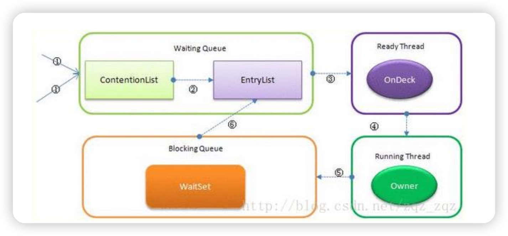


1. JVM 每次从队列的尾部取出一个数据用于锁竞争候选者（OnDeck），但是并发情况下，
   ContentionList 会被大量的并发线程进行 CAS 访问，为了降低对尾部元素的竞争，JVM 会将
   一部分线程移动到 EntryList 中作为候选竞争线程。
2. Owner 线程会在 unlock 时，将 ContentionList 中的部分线程迁移到 EntryList 中并指定
   EntryList 中的某个线程为 OnDeck 线程（一般是最先进去的那个线程）。
3. Owner 线程并不直接把锁传递给 OnDeck 线程，而是把锁竞争的权利交给 OnDeck，
   OnDeck 需要重新竞争锁。这样虽然牺牲了一些公平性，但是能极大的提升系统的吞吐量，在
   JVM 中，也把这种选择行为称之为“竞争切换”。
4. OnDeck 线程获取到锁资源后会变为 Owner 线程，而没有得到锁资源的仍然停留在 EntryList
   中。如果 Owner 线程被 wait 方法阻塞，则转移到 WaitSet 队列中，直到某个时刻通过 notify
   或者 notifyAll 唤醒，会重新进去 EntryList 中。
5. 处于 ContentionList、EntryList、WaitSet 中的线程都处于阻塞状态，该阻塞是由操作系统
   来完成的（Linux 内核下采用 pthread_mutex_lock 内核函数实现的）。
6. Synchronized 是非公平锁。 Synchronized 在线程进入 ContentionList 时，等待的线程会先
   尝试自旋获取锁，如果获取不到就进入 ContentionList，这明显对于已经进入队列的线程是
   不公平的，还有一个不公平的事情就是自旋获取锁的线程还可能直接抢占 OnDeck 线程的锁
   资源。
   参考：https://blog.csdn.net/zqz_zqz/article/details/70233767
7. 每个对象都有个 monitor 对象，加锁就是在竞争 monitor 对象，代码块加锁是在前后分别加
   上 monitorenter 和 monitorexit 指令来实现的，方法加锁是通过一个标记位来判断的
8. synchronized 是一个重量级操作，需要调用操作系统相关接口，性能是低效的，有可能给线
   程加锁消耗的时间比有用操作消耗的时间更多。
9. Java1.6，synchronized 进行了很多的优化，有适应自旋、锁消除、锁粗化、轻量级锁及偏向
   锁等，效率有了本质上的提高。在之后推出的 Java1.7 与 1.8 中，均对该关键字的实现机理做
   了优化。引入了偏向锁和轻量级锁。都是在对象头中有标记位，不需要经过操作系统加锁。
10. 锁可以从偏向锁升级到轻量级锁，再升级到重量级锁。这种升级过程叫做锁膨胀；
11. JDK 1.6 中默认是开启偏向锁和轻量级锁，可以通过-XX:-UseBiasedLocking 来禁用偏向锁。

### ReentrantLock 与 synchronized

1. ReentrantLock 通过方法 lock()与 unlock()来进行加锁与解锁操作，与 synchronized 会
   被 JVM 自动解锁机制不同，ReentrantLock 加锁后需要手动进行解锁。最好在finally中进行
2. ReentrantLock 相比 synchronized 的优势是可中断、公平锁、多个锁。这种情况下需要
   使用 ReentrantLock。

```
public class MyService {
     private Lock lock = new ReentrantLock();
         //Lock lock=new ReentrantLock(true);//公平锁
         //Lock lock=new ReentrantLock(false);//非公平锁
         private Condition condition=lock.newCondition();//创建 Condition
        public void testMethod() {
         try {
             lock.lock();//lock 加锁
            //1：wait 方法等待：
             //System.out.println("开始 wait");
             condition.await();
            //通过创建 Condition 对象来使线程 wait，必须先执行 lock.lock 方法获得锁
            //:2：signal 方法唤醒
            condition.signal();//condition 对象的 signal 方法可以唤醒 wait 线程
             for (int i = 0; i < 5; i++) {
                System.out.println("ThreadName=" + Thread.currentThread().getName()+ (" " + (i + 1)));
             }
         } catch (InterruptedException e) {
             e.printStackTrace();
         }finally{
            lock.unlock();
         }
     }
}
```

### Condition 类和 Object 类锁方法区别区别

1. Condition 类的 awiat 方法和 Object 类的 wait 方法等效
2. Condition 类的 signal 方法和 Object 类的 notify 方法等效
3. Condition 类的 signalAll 方法和 Object 类的 notifyAll 方法等效
4. ReentrantLock 类可以唤醒指定条件的线程，而 object 的唤醒是随机的

### tryLock 和 lock 和 lockInterruptibly 的区别

1. tryLock 能获得锁就返回 true，不能就立即返回 false，tryLock(long timeout,TimeUnit
   unit)，可以增加时间限制，如果超过该时间段还没获得锁，返回 false
2. lock 能获得锁就返回 true，不能的话一直等待获得锁
3. lock 和 lockInterruptibly，如果两个线程分别执行这两个方法，但此时中断这两个线程，
   lock 不会抛出异常，而 lockInterruptibly 会抛出异常。

### AtomicInteger

一个提供原子操作的 Integer 的类，常见的还有AtomicBoolean、AtomicInteger、AtomicLong、AtomicReference 等，他们的实现原理相同，
区别在与运算对象类型的不同。令人兴奋地，还可以通过 AtomicReference<V>将一个对象的所
有操作转化成原子操作。

### ReadWriteLock 读写锁

为了提高性能，Java 提供了读写锁，在读的地方使用读锁，在写的地方使用写锁，灵活控制，如
果没有写锁的情况下，读是无阻塞的,在一定程度上提高了程序的执行效率。读写锁分为读锁和写
锁，多个读锁不互斥，读锁与写锁互斥，这是由 jvm 自己控制的，你只要上好相应的锁即可。

```
import java.util.concurrent.locks.ReadWriteLock;
import java.util.concurrent.locks.ReentrantReadWriteLock;

public class ReadWriteLockExample {
    private final ReadWriteLock lock = new ReentrantReadWriteLock();
    private int sharedData = 0;

    public int readData() {
        lock.readLock().lock();
        try {
            // Reading the shared data
            return sharedData;
        } finally {
            lock.readLock().unlock();
        }
    }

    public void writeData(int newData) {
        lock.writeLock().lock();
        try {
            // Writing to the shared data
            sharedData = newData;
        } finally {
            lock.writeLock().unlock();
        }
    }

    public static void main(String[] args) {
        ReadWriteLockExample example = new ReadWriteLockExample();

        // Reading thread
        Thread readerThread = new Thread(() -> {
            for (int i = 0; i < 5; i++) {
                int data = example.readData();
                System.out.println("Read: " + data);
            }
        });

        // Writing thread
        Thread writerThread = new Thread(() -> {
            for (int i = 1; i <= 5; i++) {
                example.writeData(i);
                System.out.println("Write: " + i);
            }
        });

        readerThread.start();
        writerThread.start();

        try {
            readerThread.join();
            writerThread.join();
        } catch (InterruptedException e) {
            e.printStackTrace();
        }
    }
}
```

### CopyOnWriteArrayList

CopyOnWriteArrayList 是 Java 中线程安全的集合类，它适用于读多写少的场景，提供了一种通过复制来实现线程安全的方式。每次进行写操作时，它会创建一个新的数组副本，从而保证写操作的线程安全性，而读操作则可以并发进行，不需要加锁。这使得 CopyOnWriteArrayList 在特定的应用场景中非常有用，比如在读取操作远远多于写入操作时。

### 共享锁、独占锁

* 独占锁
  独占锁模式下，每次只能有一个线程能持有锁，ReentrantLock 就是以独占方式实现的互斥锁。
  独占锁是一种悲观保守的加锁策略，它避免了读/读冲突，如果某个只读线程获取锁，则其他读线
  程都只能等待，这种情况下就限制了不必要的并发性，因为读操作并不会影响数据的一致性。
* 共享锁
  共享锁则允许多个线程同时获取锁，并发访问 共享资源，如：ReadWriteLock。共享锁则是一种
  乐观锁，它放宽了加锁策略，允许多个执行读操作的线程同时访问共享资源。
* * AQS 的内部类 Node 定义了两个常量 SHARED 和 EXCLUSIVE，他们分别标识 AQS 队列中等
    待线程的锁获取模式。
* * java 的并发包中提供了 ReadWriteLock，读-写锁。它允许一个资源可以被多个读操作访问，
    或者被一个 写操作访问，但两者不能同时进行。

### 重量级锁、轻量级锁、偏向锁、分段锁

Synchronized 是通过对象内部的一个叫做监视器锁（monitor）来实现的。但是监视器锁本质又
是依赖于底层的操作系统的 Mutex Lock 来实现的。而操作系统实现线程之间的切换这就需要从用
户态转换到核心态，这个成本非常高，状态之间的转换需要相对比较长的时间，这就是为什么
Synchronized 效率低的原因。
因此，这种依赖于操作系统 Mutex Lock 所实现的锁我们称之为"重量级锁"。JDK 中Synchronized 做的种种优化，其核心都是为了减少这种重量级锁的使用。JDK1.6 以后，为了减少获得锁和释放锁所带来的性能消耗，提高性能，引入了“轻量级锁”和“偏向锁”。

锁的状态总共有四种：无锁状态、偏向锁、轻量级锁和重量级锁。

* 锁升级
  随着锁的竞争，锁可以从偏向锁升级到轻量级锁，再升级的重量级锁（但是锁的升级是单向的，
  也就是说只能从低到高升级，不会出现锁的降级）。
  "轻量级"是相对于使用操作系统互斥量来实现的传统锁而言的。但是，首先需要强调一点的是，
  轻量级锁并不是用来代替重量级锁的，它的本意是在没有多线程竞争的前提下，减少传统的重量
  级锁使用产生的性能消耗。在解释轻量级锁的执行过程之前，先明白一点，轻量级锁所适应的场
  景是线程交替执行同步块的情况，如果存在同一时间访问同一锁的情况，就会导致轻量级锁膨胀
  为重量级锁。
* 偏向锁
  Hotspot 的作者经过以往的研究发现大多数情况下锁不仅不存在多线程竞争，而且总是由同一线
  程多次获得。偏向锁的目的是在某个线程获得锁之后，消除这个线程锁重入（CAS）的开销，看起
  来让这个线程得到了偏护。引入偏向锁是为了在无多线程竞争的情况下尽量减少不必要的轻量级
  锁执行路径，因为轻量级锁的获取及释放依赖多次 CAS 原子指令，而偏向锁只需要在置换
  ThreadID 的时候依赖一次 CAS 原子指令（由于一旦出现多线程竞争的情况就必须撤销偏向锁，所
  以偏向锁的撤销操作的性能损耗必须小于节省下来的 CAS 原子指令的性能消耗）。上面说过，轻
  量级锁是为了在线程交替执行同步块时提高性能，而偏向锁则是在只有一个线程执行同步块时进
  一步提高性能。
* 分段锁
  分段锁也并非一种实际的锁，而是一种思想 ConcurrentHashMap 是学习分段锁的最好实践锁优化

1. 减少锁持有时间
   只用在有线程安全要求的程序上加锁
2. 减小锁粒度
   将大对象（这个对象可能会被很多线程访问），拆成小对象，大大增加并行度，降低锁竞争。
   降低了锁的竞争，偏向锁，轻量级锁成功率才会提高。最最典型的减小锁粒度的案例就是
   ConcurrentHashMap。
3. 锁分离
   最常见的锁分离就是读写锁 ReadWriteLock，根据功能进行分离成读锁和写锁，这样读读不互
   斥，读写互斥，写写互斥，即保证了线程安全，又提高了性能，具体也请查看[高并发 Java 五]
   JDK 并发包 1。读写分离思想可以延伸，只要操作互不影响，锁就可以分离。比如
   LinkedBlockingQueue 从头部取出，从尾部放数据
4. 锁粗化
   通常情况下，为了保证多线程间的有效并发，会要求每个线程持有锁的时间尽量短，即在使用完
   公共资源后，应该立即释放锁。但是，凡事都有一个度，如果对同一个锁不停的进行请求、同步
   和释放，其本身也会消耗系统宝贵的资源，反而不利于性能的优化 。
5. 锁消除
   锁消除是在编译器级别的事情。在即时编译器时，如果发现不可能被共享的对象，则可以消除这
   些对象的锁操作，多数是因为程序员编码不规范引起

### 阻塞队列

1. ArrayBlockingQueue（公平、非公平）：由数组结构组成的有界阻塞队列。
   用数组实现的有界阻塞队列。此队列按照先进先出（FIFO）的原则对元素进行排序。默认情况下
   不保证访问者公平的访问队列，所谓公平访问队列是指阻塞的所有生产者线程或消费者线程，当
   队列可用时，可以按照阻塞的先后顺序访问队列，即先阻塞的生产者线程，可以先往队列里插入
   元素，先阻塞的消费者线程，可以先从队列里获取元素。通常情况下为了保证公平性会降低吞吐
   量。我们可以使用以下代码创建一个公平的阻塞队列：

```
ArrayBlockingQueue fairQueue = new ArrayBlockingQueue(1000,true);
```

2. LinkedBlockingQueue（两个独立锁提高并发）：由链表结构组成的有界阻塞队列。
   基于链表的阻塞队列，同 ArrayListBlockingQueue 类似，此队列按照先进先出（FIFO）的原则对
   元素进行排序。而 LinkedBlockingQueue 之所以能够高效的处理并发数据，还因为其对于生产者
   端和消费者端分别采用了独立的锁来控制数据同步，这也意味着在高并发的情况下生产者和消费
   者可以并行地操作队列中的数据，以此来提高整个队列的并发性能。
   LinkedBlockingQueue 会默认一个类似无限大小的容量（Integer.MAX_VALUE）。
3. PriorityBlockingQueue（compareTo 排序实现优先）：支持优先级排序的无界阻塞队列。
   是一个支持优先级的无界队列。默认情况下元素采取自然顺序升序排列。可以自定义实现
   compareTo()方法来指定元素进行排序规则，或者初始化 PriorityBlockingQueue 时，指定构造
   参数 Comparator 来对元素进行排序。需要注意的是不能保证同优先级元素的顺序。
4. DelayQueue（缓存失效、定时任务 ）：使用优先级队列实现的无界阻塞队列。
   是一个支持延时获取元素的无界阻塞队列。队列使用 PriorityQueue 来实现。队列中的元素必须实
   现 Delayed 接口，在创建元素时可以指定多久才能从队列中获取当前元素。只有在延迟期满时才
   能从队列中提取元素。
   我们可以将 DelayQueue 运用在以下应用场景：

* 缓存系统的设计：可以用 DelayQueue 保存缓存元素的有效期，使用一个线程循环查询
  DelayQueue，一旦能从 DelayQueue 中获取元素时，表示缓存有效期到了。
* 定时任务调度：使用 DelayQueue 保存当天将会执行的任务和执行时间，一旦从
  DelayQueue 中获取到任务就开始执行，从比如 TimerQueue 就是使用 DelayQueue 实现的。

5. SynchronousQueue（不存储数据、可用于传递数据）：不存储元素的阻塞队列。
   是一个不存储元素的阻塞队列。每一个 put 操作必须等待一个 take 操作，否则不能继续添加元素。
   SynchronousQueue 可以看成是一个传球手，负责把生产者线程处理的数据直接传递给消费者线
   程。队列本身并不存储任何元素，非常适合于传递性场景,比如在一个线程中使用的数据，传递给
   另外一个线程使用， SynchronousQueue 的吞吐量高于 LinkedBlockingQueue 和
   ArrayBlockingQueue。
6. LinkedTransferQueue：由链表结构组成的无界阻塞队列。
   是一个由链表结构组成的无界阻塞 TransferQueue 队列。相对于其他阻塞队列，
   LinkedTransferQueue 多了 tryTransfer 和 transfer 方法。

* transfer 方法：如果当前有消费者正在等待接收元素（消费者使用 take()方法或带时间限制的
  poll()方法时），transfer 方法可以把生产者传入的元素立刻 transfer（传输）给消费者。如
  果没有消费者在等待接收元素，transfer 方法会将元素存放在队列的 tail 节点，并等到该元素
  被消费者消费了才返回。
* tryTransfer 方法。则是用来试探下生产者传入的元素是否能直接传给消费者。如果没有消费
  者等待接收元素，则返回 false。和 transfer 方法的区别是 tryTransfer 方法无论消费者是否
  接收，方法立即返回。而 transfer 方法是必须等到消费者消费了才返回。
  对于带有时间限制的 tryTransfer(E e, long timeout, TimeUnit unit)方法，则是试图把生产者传
  入的元素直接传给消费者，但是如果没有消费者消费该元素则等待指定的时间再返回，如果超时
  还没消费元素，则返回 false，如果在超时时间内消费了元素，则返回 true。

7. LinkedBlockingDeque：由链表结构组成的双向阻塞队列
   是一个由链表结构组成的双向阻塞队列。所谓双向队列指的你可以从队列的两端插入和移出元素。
   双端队列因为多了一个操作队列的入口，在多线程同时入队时，也就减少了一半的竞争。相比其
   他的阻塞队列，LinkedBlockingDeque 多了 addFirst，addLast，offerFirst，offerLast，
   peekFirst，peekLast 等方法，以 First 单词结尾的方法，表示插入，获取（peek）或移除双端队
   列的第一个元素。以 Last 单词结尾的方法，表示插入，获取或移除双端队列的最后一个元素。另
   外插入方法 add 等同于 addLast，移除方法 remove 等效于 removeFirst。但是 take 方法却同
   于 takeFirst，不知道是不是 Jdk 的 bug，使用时还是用带有 First 和 Last 后缀的方法更楚。
   在初始化 LinkedBlockingDeque 时可以设置容量防止其过渡膨胀。另外双向阻塞队列可以运用在
   “工作窃取”模式中

__方法__

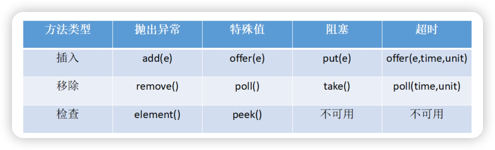

* add
  将指定元素插入此队列中（如果立即可行且不会违反容量限制），成功时返回 true，如果当前没有可用的空间，则抛出 IllegalStateException。如果该元素是 NULL，则会抛出NullPointerException 异常。
* offer
  将指定元素插入此队列中（如果立即可行且不会违反容量限制），成功时返回 true，如果当前没有可用的空间，则返回 false。offer(E o, long timeout, TimeUnit unit)：可以设定等待的时间，如果在指定的时间内，还不能往队列中加入 BlockingQueue，则返回失败
* put
  将指定元素插入此队列中，将等待可用的空间（如果有必要）
* poll
  取走 BlockingQueue 里排在首位的对象,若不能立即取出,则可以等 time 参数
  规定的时间,取不到时返回 null
* take
  取走 BlockingQueue 里排在首位的对象,若 BlockingQueue 为空,阻断进入等待状态直到 BlockingQueue 有新的数据被加入
* drainTo
  一次性从 BlockingQueue 获取所有可用的数据对象（还可以指定获取数据的个数），通过该方法，可以提升获取数据效率；不需要多次分批加锁或释放锁。

### CyclicBarrier、CountDownLatch、Semaphore

__Semaphore__
Semaphore 是一种基于计数的信号量。它可以设定一个阈值，基于此，多个线程竞争获取许可信
号，做完自己的申请后归还，超过阈值后，线程申请许可信号将会被阻塞。Semaphore 可以用来
构建一些对象池，资源池之类的，比如数据库连接池.

```
// 创建一个计数阈值为 5 的信号量对象
// 只能 5 个线程同时访问
Semaphore semp = new Semaphore(5);
try { // 申请许可
    semp.acquire();
    try {
    // 业务逻辑
    } catch (Exception e) {
    } finally {
        // 释放许可
        semp.release();
    }
} catch (InterruptedException e) {
}
```

Semaphore 基本能完成 ReentrantLock 的所有工作，使用方法也与之类似，通过 acquire()与
release()方法来获得和释放临界资源。经实测，Semaphone.acquire()方法默认为可响应中断锁，
与 ReentrantLock.lockInterruptibly()作用效果一致，也就是说在等待临界资源的过程中可以被
Thread.interrupt()方法中断。

此外，Semaphore 也实现了可轮询的锁请求与定时锁的功能，除了方法名 tryAcquire 与 tryLock
不同，其使用方法与 ReentrantLock 几乎一致。Semaphore 也提供了公平与非公平锁的机制，也
可在构造函数中进行设定。

Semaphore 的锁释放操作也由手动进行，因此与 ReentrantLock 一样，为避免线程因抛出异常而
无法正常释放锁的情况发生，释放锁的操作也必须在 finally 代码块中完成。

__CountDownLatch__
CountDownLatch 类位于 java.util.concurrent 包下，利用它可以实现类似计数器的功能.

__CyclicBarrier__
字面意思回环栅栏，通过它可以实现让一组线程等待至某个状态之后再全部同时执行。是因为当所有等待线程都被释放以后，CyclicBarrier 可以被重用。我们暂且把这个状态就叫做barrier，当调用 await()方法之后，线程就处于 barrier 了。
CyclicBarrier 中最重要的方法就是 await 方法，它有 2 个重载版本：

1. public int await()：用来挂起当前线程，直至所有线程都到达 barrier 状态再同时执行后续任
   务；
2. public int await(long timeout, TimeUnit unit)：让这些线程等待至一定的时间，如果还有
   线程没有到达 barrier 状态就直接让到达 barrier 的线程执行后续任务

```
import java.util.concurrent.BrokenBarrierException;
import java.util.concurrent.CyclicBarrier;

public class CyclicBarrierExample {

    public static void main(String[] args) {
        final int NUM_ATHLETES = 3;
        CyclicBarrier barrier = new CyclicBarrier(NUM_ATHLETES, () -> {
            System.out.println("所有运动员准备完毕，比赛开始！");
        });

        for (int i = 0; i < NUM_ATHLETES; i++) {
            Thread athleteThread = new Thread(() -> {
                try {
                    System.out.println("运动员" + Thread.currentThread().getId() + "正在准备");
                    Thread.sleep((long) (Math.random() * 3000)); // 模拟准备时间
                    System.out.println("运动员" + Thread.currentThread().getId() + "准备完毕");
                    barrier.await();
                    System.out.println("运动员" + Thread.currentThread().getId() + "开始比赛");
                } catch (InterruptedException | BrokenBarrierException e) {
                    e.printStackTrace();
                }
            });
            athleteThread.start();
        }
    }
}
```

### volatile

有两个主要特性

* 变量可见性
  其一是保证该变量对所有线程可见，这里的可见性指的是当一个线程修改了变量的值,那么新的值对于其他线程是可以独立获取的
* 禁止重排序
  volatile 禁止了指令重排。比 sychronized 更轻量级的同步锁

volatile 适合这种场景：一个变量被多个线程共享，线程直接给这个变量赋值,JVM 保证了每次读变量都从内存中读，跳过 CPU cache 这一步。值得说明的是对 volatile 变量的单次读/写操作可以保证原子性的，如 long 和 double 类型变量，
但是并不能保证 i++这种操作的原子性，因为本质上 i++是读、写两次操作。在某些场景下可以
代替 Synchronized。但是,volatile 的不能完全取代 Synchronized 的位置，只有在一些特殊的场景下，才能适用 volatile。总的来说，必须同时满足下面两个条件才能保证在并发环境的线程安
全
（1）对变量的写操作不依赖于当前值（比如 i++），或者说是单纯的变量赋值（boolean flag = true）。
（2）该变量没有包含在具有其他变量的不变式中，也就是说，不同的 volatile 变量之间，不
能互相依赖。只有在状态真正独立于程序内其他内容时才能使用 volatile。

### 如何在两个线程之间共享数据

Java 里面进行多线程通信的主要方式就是共享内存的方式，共享内存主要的关注点有两个：可见
性和有序性、原子性。Java 内存模型（JMM）解决了可见性和有序性的问题，而锁解决了原子性的
问题，理想情况下我们希望做到"同步"和"互斥"。

* 共享变量：可以声明一个共享变量，并在两个线程中使用该变量。需要注意的是，如果多个线程同时对该共享变量进行读写操作，可能会导致数据不一致的问题，需要使用同步机制（如synchronized）来保证原子性。
* 队列（Queue）：可以使用队列实现两个线程之间的数据共享。其中一个线程将数据放入队列，另一个线程从队列中取出数据。
* 共享对象：可以创建一个共享对象，在该对象中定义要共享的数据和对数据的访问方法。注意共享对象中对变量的操作需要加上synchronized锁之类的来限制

### ThreadLocal

1. 每个线程独享的存储空间，都有一个自己的 ThreadLocalMap 类对象，可以将线程自己的对象保持到其中，各管各的，线程可以正确的访问到自己的对象。
2. 将一个共用的 ThreadLocal 静态实例作为 key，将不同对象的引用保存到不同线程的
   ThreadLocalMap 中，然后在线程执行的各处通过这个静态 ThreadLocal 实例的 get()方法取
   得自己线程保存的那个对象，避免了将这个对象作为参数传递的麻烦.

使用时候注意事项

* 内存泄漏：由于ThreadLocal中存储的数据与线程绑定，而线程结束后，ThreadLocal中的数据不会自动清理。如果在应用程序中长时间使用ThreadLocal，并且没有适当地调用remove()方法来清理数据，可能会导致内存泄漏。因此，在使用完ThreadLocal后，应该及时调用remove()方法来清理数据，可以在finally块中进行清理。
* 共享状态问题：虽然ThreadLocal可以在每个线程中保存独立的数据副本，但它并不能解决多个线程之间共享状态的问题。如果多个线程之间需要共享数据，仍然需要使用其他同步机制（如锁）来保证数据的一致性。
* 不适用于线程池：由于ThreadLocal与线程绑定，如果在使用线程池的情况下直接使用ThreadLocal，可能会导致线程复用时数据错乱的问题。因此，在使用线程池的场景下，应该避免直接使用ThreadLocal，或者在使用前清理ThreadLocal的数据。

适度使用：ThreadLocal虽然提供了一种方便的方式来实现线程封闭性，但过度使用ThreadLocal可能会导致代码的可读性变差和难以维护。应该根据具体的需求和场景来决定是否使用ThreadLocal。

__弱引用问题__
在ThreadLocal中，使用了Java中的弱引用（WeakReference）来存储线程本地变量。弱引用是一种比较特殊的引用类型，当对象只有弱引用指向它时，垃圾收集器在下次进行垃圾回收时会自动回收该对象。

ThreadLocal中使用弱引用的主要目的是为了解决内存泄漏的问题。每个ThreadLocal对象都会有一个对应的线程本地变量表，这个表中存储了所有线程的本地变量。当一个线程结束后，它的线程本地变量表中的所有变量都会成为垃圾，应该被垃圾收集器回收。但如果线程本地变量表中的变量是强引用，即使线程已经结束，这些变量仍然无法被回收，从而导致内存泄漏。

使用弱引用可以避免这个问题。当一个线程结束后，垃圾收集器会自动回收线程本地变量表中的弱引用对象，从而释放占用的内存空间。这样，ThreadLocal中存储的数据也会被清理，避免了内存泄漏。

需要注意的是，虽然ThreadLocal中使用了弱引用，但ThreadLocal对象本身并不是弱引用，它仍然是一个强引用。只是ThreadLocal对象中的引用存储的是弱引用对象。当ThreadLocal对象没有被其他强引用所引用时，ThreadLocal对象本身也会成为垃圾，同时也会触发线程本地变量表的清理工作。

总结起来，ThreadLocal中使用弱引用来存储线程本地变量，可以确保在线程结束后，线程本地变量能够被垃圾回收，从而避免内存泄漏的问题。

### 线程调度

* 抢占式调度 抢占式调度指的是每条线程执行的时间、线程的切换都由系统控制，系统控制指的是在系统某种运行机制下，可能每条线程都分同样的执行时间片，也可能是某些线程执行的时间片较长，甚至
  某些线程得不到执行的时间片。在这种机制下，一个线程的堵塞不会导致整个进程堵塞。
* 协同式调度 协同式调度指某一线程执行完后主动通知系统切换到另一线程上执行，这种模式就像接力赛一样，一个人跑完自己的路程就把接力棒交接给下一个人，下个人继续往下跑。线程的执行时间由线程本身控制，线程切换可以预知，不存在多线程同步问题，但它有一个致命弱点：如果一个线程编写有问题，运行到一半就一直堵塞，那么可能导致整个系统崩溃。

__调度算法__
先来先服务调度算法（FCFS）
短作业(进程)优先调度算法
高优先权优先调度算法
非抢占式优先权算法
抢占式优先权调度算法
高响应比优先调度算法
基于时间片的轮转调度算法

## 异常

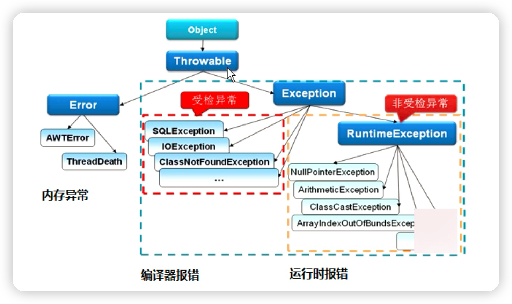

Throwable 是 Java 语言中所有错误或异常的超类,下一层分为 Error 和 Exception

* Error
  Error 类是指 java 运行时系统的内部错误和资源耗尽错误。应用程序不会抛出该类对象。如果
  出现了这样的错误，除了告知用户，剩下的就是尽力使程序安全的终止。
* Exception
  Exception分为，RuntimeException(运行时异常)、CheckedException。
  RuntimeException 如：NullPointerException、ClassCastException

一个是检查异常CheckedException，如 I/O 错误导致的 IOException、SQLException。
RuntimeException 是那些可能在 Java 虚拟机正常运行期间抛出的异常的超类。

如果出现 RuntimeException，那么一定是程序员的错误。检查异常 CheckedException 一般是外部错误，这种异常都发生在编译阶段，Java 编译器会强制程序去捕获此类异常，即会出现要求你把这段可能出现异常的程序进行 try catch。
该类常一般包括几个方面：

1. 试图在文件尾部读取数据
2. 试图打开一个错误格式的 URL
3. 试图根据给定的字符串查找 class 对象，而这个字符串表示的类并不存在.

### 处理异常

抛出异常有三种形式，一是 throw,一个 throws，还有一种系统自动抛异常。

### throw和throws

1. 位置不同。throws 用在函数上，后面跟的是异常类，可以跟多个；而 throw 用在函数内，后面跟的是异常对象。
2. 功能不同。throws 用来声明异常，让调用者只知道该功能可能出现的问题，可以给出预先的处理方式；throw 抛出具体的问题对象，执行到 throw，功能就已经结束了跳转到调用者，并将具体的问题对象抛给调用者。也就是说 throw 语句独立存在时，下面不要定义其他语句，因为执行不到。
3. throws 表示出现异常的一种可能性，并不一定会发生这些异常；throw 则是抛出了异常，
   执行 throw 则一定抛出了某种异常对象。
4. 两者都是消极处理异常的方式，只是抛出或者可能抛出异常，但是不会由函数去处理异
   常，真正的处理异常由函数的上层调用处理。
